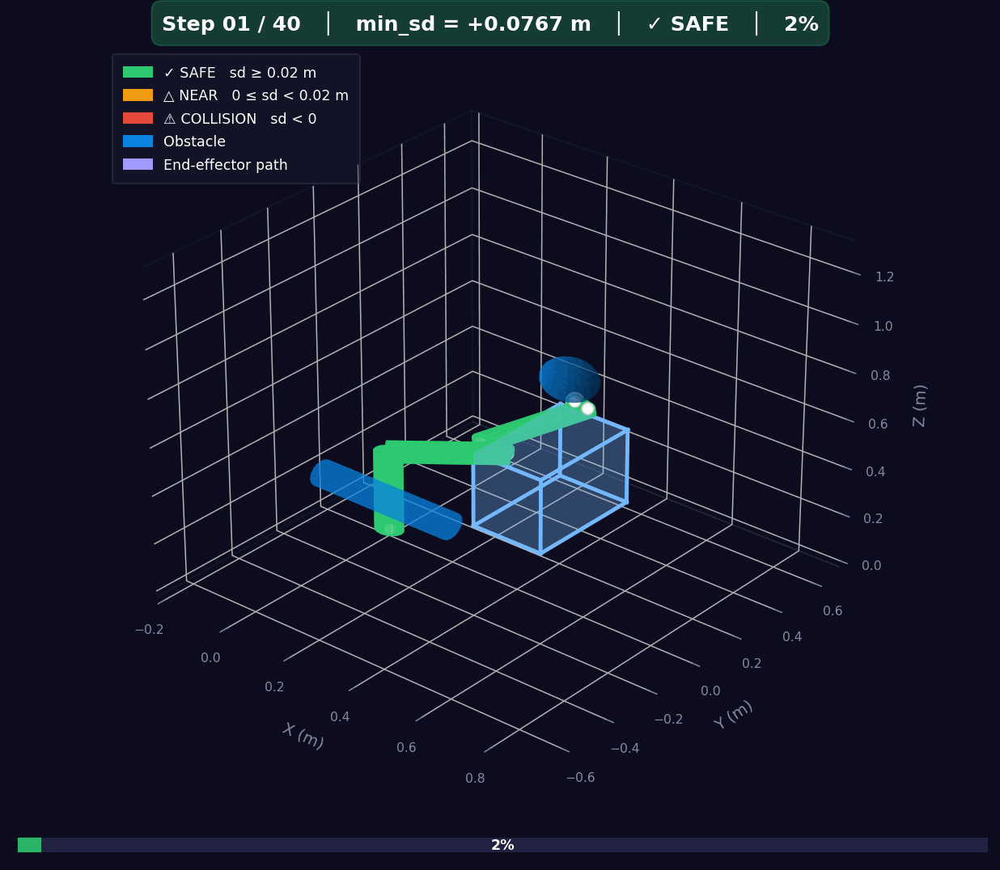

# 7DoF Arm Motion Planner


**Panda-like 7DoF × 3D Primitive Obstacles × RRT\* (+TrajOpt optional)**



---

## Overview

A self-contained C++ motion planning system for a 7-DoF robot arm operating in environments with 3D primitive obstacles (box / sphere / capsule).

| Feature | Status |
|---------|--------|
| RRT\* planner | ✅ |
| Adaptive edge collision check | ✅ |
| TrajOpt (SCP + ℓ1 penalty) | ✅ optional |
| GIF visualisation | ✅ (Python render script) |
| Unit tests (distance / normals / finite-diff) | ✅ |

---

## ⚠️ Conventions (READ FIRST)

This section is the **single source of truth** for all modules.

### Units
| Quantity | Unit |
|----------|------|
| Length | m |
| Angles | rad |

### Coordinate Frame
- Right-hand system, **Z-up**
- `p_world = R(q) × p_local + t`

### Quaternion Convention
```
quat = [w, x, y, z]      ← w first (wxyz order)
Active rotation           ← rotates the vector
```

### Shape Size Definitions
| Shape | Fields | Meaning |
|-------|--------|---------|
| sphere | `radius` | radius (m) |
| box | `half_extents: [hx, hy, hz]` | **half-side** (full = 2×half) |
| capsule | `radius`, `half_length` | half of axis length (full = 2×half_length, excluding end caps) |

### Signed Distance Convention
```
sd > 0  : separated (safe)
sd = 0  : contact
sd < 0  : penetrating

normal n : obstacle → robot  (push-out direction)
invariant: sd ≈ dot(p_robot - p_obs, n)
```

> **Note:** This is a "Panda-like" model. Joint limits follow the Franka Panda specification approximately but **this is not a strict Panda implementation** and does not depend on URDF/ROS/MoveIt.

---

## Dependencies

| Library | Purpose | How to get |
|---------|---------|-----------|
| [Eigen 3](https://eigen.tuxfamily.org) | Linear algebra | `apt install libeigen3-dev` |
| [nlohmann/json](https://github.com/nlohmann/json) | JSON parsing | bundled in `third_party/` |
| Python 3 + matplotlib + numpy | GIF rendering | `pip install matplotlib numpy` |
| CMake ≥ 3.16 | Build system | `apt install cmake` |
| GTest | Unit tests | fetched by CMake FetchContent |

---

## Build

```bash
git clone https://github.com/YOUR_USERNAME/motion-planner.git
cd motion-planner

cmake -B build -DCMAKE_BUILD_TYPE=Release
cmake --build build -j$(nproc)
```

### Run planner

```bash
./build/motion_planner scene.json
```

Output is written to `out/`:
- `out/trajectory.csv` — planned waypoints
- `out/plan.log`       — timing, cost, min_sd statistics

### Render GIF

```bash
python tools/render.py --csv out/trajectory.csv --scene scene.json --output out/plan.gif --fps 15
```

### Run tests

```bash
cd build && ctest --output-on-failure
```

---

## Project Structure

```
src/
  math/           vec3, quat, mat3 (header-only)
  geometry/       primitives, transforms, distance kernels
  kinematics/     FK, Jacobian
  collision/      CollisionChecker (query + checkMotion)
  planner/        RRT*, sampling, kd-tree (optional)
  trajopt/        TrajOpt SCP (optional)
  io/             scene.json loader, logger
tools/
  render.py       CSV → PNG → GIF
tests/
  test_distance.cpp
  test_normals.cpp
  test_finite_diff.cpp
third_party/
  nlohmann/json.hpp
```

---

## Acceptance Criteria

| # | Criterion |
|---|-----------|
| ① | Success rate ≥ 80% within 60 s (10 runs, seeds 0–9) |
| ② | All path segments pass `checkMotion` (adaptive bisection) |
| ③ | `min_sd ≥ 0` on all waypoints (no penetration) |
| ④ | `min_sd ≥ d_safe` after TrajOpt (goal metric) |
| ⑤ | GIF shows collision shapes matching obstacles; danger zones visible |

---

## License

MIT
